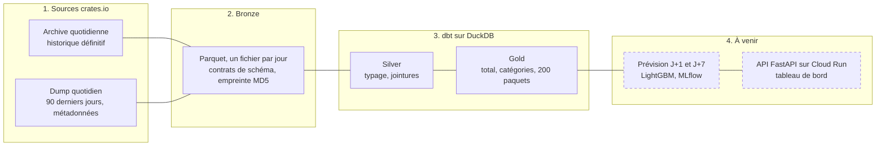

# PkgPulse

[](../../actions/workflows/ci.yml)


**Plateforme data construite sur les téléchargements réels de crates.io, le registre de paquets
Rust.** Un pipeline idempotent alimente un entrepôt en architecture médaillon, qui servira à
prévoir la demande à J+1 et J+7 par paquet et par catégorie, et à détecter les anomalies. Le
problème est le même que la prévision de la demande dans le retail : saisonnalité hebdomadaire,
séries avec des zéros, effets de nouvelles versions, pics exogènes.


## Points clés

- **Ingestion idempotente** : un jour correspond à un fichier Parquet, remplacé de façon atomique.
  Relancer ne crée jamais de doublon, et une exécution interrompue reprend au premier jour
  manquant (testé, et vérifié en conditions réelles lors du premier backfill).
- **Données tardives** : l'archive, définitive mais en retard de trois mois, et le dump quotidien,
  qui couvre les 90 derniers jours, sont joints par une règle testée. Chaque correction tardive
  est journalisée.
- **Contrats de schéma** : crates.io ne garantit pas la stabilité de son schéma. Une colonne
  manquante ou une clé en double arrête l'ingestion avant toute écriture.
- **dbt en architecture médaillon** : 10 modèles, 33 tests (unicité, fraîcheur, jours manquants,
  chute de volume) et un snapshot qui garde l'historique des paquets.
- **Données ouvertes** : les agrégats gold sont publiés en CSV dans la
  [release gold](../../releases/tag/gold), mis à jour par le pipeline.
- **Qualité** : 29 tests pytest contre un faux serveur crates.io local, CI (lint, tests, dbt sur un
  échantillon synthétique), pre-commit.

## Architecture



## Ce que disent les données

- **La demande a été multipliée par 2,6** entre novembre 2025 et juin 2026 : de 382 à 1 008
  millions de téléchargements par jour, en moyenne mensuelle.
- **La saisonnalité hebdomadaire est forte** : un dimanche pèse environ la moitié d'un mardi, et le
  creux le plus profond tombe à Noël. Les tests de volume comparent donc chaque jour au même jour
  des semaines précédentes.
- **Une rupture de comptage** : fin octobre 2025, crates.io n'a plus compté que les
  téléchargements faits par cargo. Le nombre de lignes quotidiennes est divisé par 2,5 à 4, d'où un
  historique qui commence au 1er novembre 2025, dans un régime de comptage homogène.

## Avancement

- [x] Ingestion bronze : archive, dump, jonction, données tardives
- [x] Modèles dbt silver et gold, tests et snapshot
- [x] Orchestration : DAG Airflow et exécution quotidienne planifiée
- [ ] Prévision J+1 et J+7 : baselines, LightGBM, backtest glissant, intervalles conformels
- [ ] Détection d'anomalies
- [ ] Entrepôt BigQuery et infrastructure Terraform
- [ ] API FastAPI sur Cloud Run et tableau de bord en ligne

## Démarrage

Prérequis : Python 3.14 et make.

```bash
make install   # environnement virtuel, dépendances et hooks pre-commit
make check     # lint, tests et dbt sur un échantillon synthétique, comme la CI
make ingest    # données réelles : archive depuis le 2025-11-01, puis dump du jour
make dbt       # fraîcheur des sources, modèles silver et gold, tests et snapshot
make airflow-test  # DAG Airflow rejoué sur sept jours avec l'échantillon
```

## Organisation du dépôt

```text
src/pkgpulse/ingest/   ingestion : archive, dump, jonction, contrats de schéma
airflow/dags/          DAG quotidien (dépendances, relances, backfill)
dbt/                   modèles silver et gold, tests, snapshot
tests/                 tests pytest, avec un faux serveur crates.io
docs/                  cadrage et journal des décisions
.github/workflows/     CI, pipeline quotidien, keepalive et surveillance
```

## Documentation

- [Cadrage](docs/cadrage.md) : séries prévues, horizons, ce que le modèle a le droit de savoir,
  métriques.
- [Journal des décisions](docs/DECISIONS.md) : sources, contrats de schéma, idempotence, jonction,
  tests dbt.

Données : dumps publics de crates.io, utilisés dans le respect de leur politique d'accès. Seuls des
agrégats sont publiés.
