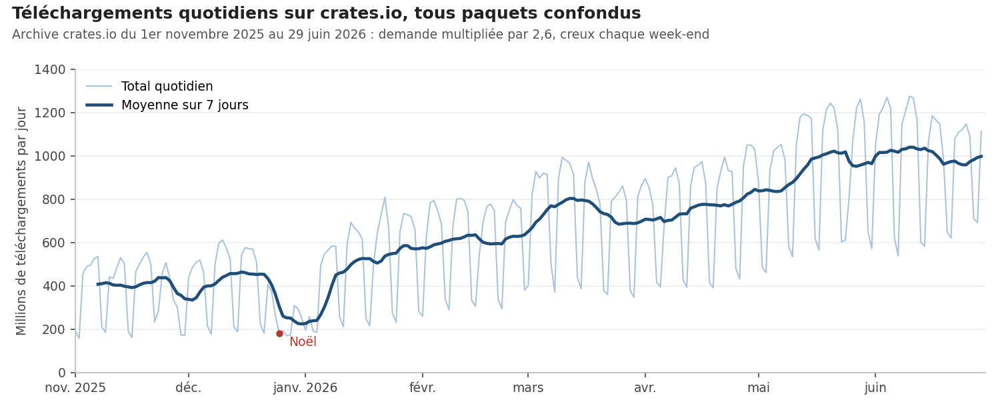
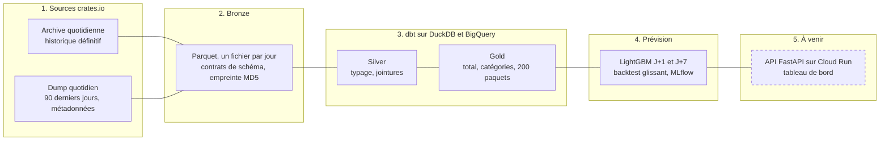

# PkgPulse

[](../../actions/workflows/ci.yml)


**Plateforme data construite sur les téléchargements réels de crates.io, le registre de paquets
Rust.** Un pipeline idempotent alimente un entrepôt en architecture médaillon, qui servira à
prévoir la demande à J+1 et J+7 par paquet et par catégorie, et à détecter les anomalies. Le
problème est le même que la prévision de la demande dans le retail : saisonnalité hebdomadaire,
séries avec des zéros, effets de nouvelles versions, pics exogènes.



## Points clés

- **Ingestion idempotente** : un jour correspond à un fichier Parquet, remplacé de façon atomique.
  Relancer ne crée jamais de doublon, et une exécution interrompue reprend au premier jour
  manquant (testé, et vérifié en conditions réelles lors du premier backfill).
- **Données tardives** : l'archive, définitive mais en retard de trois mois, et le dump quotidien,
  qui couvre les 90 derniers jours, sont joints par une règle testée. Chaque correction tardive
  est journalisée.
- **Contrats de schéma** : crates.io ne garantit pas la stabilité de son schéma. Une colonne
  manquante ou une clé en double arrête l'ingestion avant toute écriture.
- **dbt en architecture médaillon** : 10 modèles, 33 tests (unicité, fraîcheur, jours manquants,
  chute de volume) et un snapshot qui garde l'historique des paquets.
- **Prévision J+1 et J+7** : un modèle LightGBM global par horizon, appris sur 260 séries à la
  fois, comparé au naïf saisonnier et à ETS en backtest glissant, avec un test anti-fuite. Intervalles
  conformels à 90 %, runs et modèles suivis dans MLflow avec un alias champion.
- **Détection d'anomalies** : score robuste sur les résidus de prévision, et
  [étude de cas du 21 juin 2026](docs/etude-de-cas-21-juin-2026.md), un pic de six fois plus de
  versions téléchargées, invisible sur le total.
- **Données ouvertes** : les agrégats gold sont publiés en CSV dans la
  [release gold](../../releases/tag/gold), mis à jour par le pipeline.
- **Qualité** : 38 tests pytest contre un faux serveur crates.io local, CI (lint, tests, dbt sur un
  échantillon synthétique), pre-commit.

## Architecture



## Résultats du backtest

MASE moyenne par série (sous 1, on bat le naïf saisonnier) sur 9 origines de validation,
du 18 avril au 21 juin 2026, jamais utilisées pour concevoir le modèle. Le modèle global LightGBM
est le meilleur sur les paquets et les catégories, soit l'essentiel des 260 séries, et en moyenne
à chaque horizon. Sur le total, série unique et très régulière, ETS fait mieux : un modèle par
série suffit là où la série est lisse. Le pipeline refait ce backtest chaque jour sur toutes les origines ;
les tableaux à jour sont dans la [release gold](../../releases/tag/gold).

| Série | Horizon | Naïf saisonnier | ETS | LightGBM | Gain de LightGBM |
|---|---|---|---|---|---|
| Total | J+1 | 0,746 | 0,502 | 0,558 | -11 % |
| Total | J+7 | 0,741 | 0,648 | 0,679 | -5 % |
| Catégories | J+1 | 1,034 | 0,949 | 0,878 | +7 % |
| Catégories | J+7 | 1,074 | 1,100 | 0,992 | +8 % |
| Paquets suivis | J+1 | 0,823 | 0,675 | 0,625 | +7 % |
| Paquets suivis | J+7 | 1,028 | 1,140 | 1,007 | +2 % |

### Intervalles de prédiction à 90 %

Couverture mesurée sans fuite (le quantile de chaque origine ne vient que des précédentes), et
demi-largeur de l'intervalle en part du niveau des 28 derniers jours :

| Série | Couverture J+1 | Couverture J+7 | Demi-largeur J+1 | Demi-largeur J+7 |
|---|---|---|---|---|
| Total | 100 % | 100 % | 10 % | 16 % |
| Catégories | 92 % | 92 % | 20 % | 25 % |
| Paquets suivis | 96 % | 94 % | 12 % | 20 % |

Sur le total, une seule série fournit peu d'erreurs pour calibrer : le quantile conformel, prudent,
donne des intervalles plus larges que nécessaire.

### Total : prévision directe ou ascendante

MASE du total prévu directement, ou reconstitué en additionnant les prévisions des 200 paquets suivis
et de la série autres. Pour LightGBM, l'approche directe l'emporte à J+1 et l'approche ascendante à J+7.

| Modèle | J+1 direct | J+1 ascendant | J+7 direct | J+7 ascendant |
|---|---|---|---|---|
| Naïf saisonnier | 0,746 | 0,746 | 0,741 | 0,741 |
| ETS | 0,502 | 0,512 | 0,648 | 0,740 |
| LightGBM | 0,558 | 0,604 | 0,679 | 0,650 |

## Ce que disent les données

- **La demande a été multipliée par 2,6** entre novembre 2025 et juin 2026 : de 382 à 1 008
  millions de téléchargements par jour, en moyenne mensuelle.
- **La saisonnalité hebdomadaire est forte** : un dimanche pèse environ la moitié d'un mardi, et le
  creux le plus profond tombe à Noël. Les tests de volume comparent donc chaque jour au même jour
  des semaines précédentes.
- **Une rupture de comptage** : fin octobre 2025, crates.io n'a plus compté que les
  téléchargements faits par cargo. Le nombre de lignes quotidiennes est divisé par 2,5 à 4, d'où un
  historique qui commence au 1er novembre 2025, dans un régime de comptage homogène.

- **Le calendrier américain pèse** : les plus fortes anomalies tombent le 25 mai (Memorial Day)
  et le 7 septembre (Labor Day). La demande suit l'intégration continue des entreprises.

## Avancement

- [x] Ingestion bronze : archive, dump, jonction, données tardives
- [x] Modèles dbt silver et gold, tests et snapshot
- [x] Orchestration : DAG Airflow et exécution quotidienne planifiée
- [x] Prévision J+1 et J+7 : baselines, LightGBM, backtest glissant, intervalles conformels
- [x] Détection d'anomalies
- [x] Entrepôt BigQuery et infrastructure Terraform
- [ ] API FastAPI sur Cloud Run et tableau de bord en ligne

## Démarrage

Prérequis : Python 3.14 et make.

```bash
make install   # environnement virtuel, dépendances et hooks pre-commit
make check     # lint, tests et dbt sur un échantillon synthétique, comme la CI
make ingest    # données réelles : archive depuis le 2025-11-01, puis dump du jour
make dbt       # fraîcheur des sources, modèles silver et gold, tests et snapshot
make backtest  # backtest glissant des références et de LightGBM, suivi dans MLflow
make forecast  # prévisions J+1 et J+7 du modèle champion
make anomalies # anomalies sur les résidus de prévision à J+1
make airflow-test  # DAG Airflow rejoué sur sept jours avec l'échantillon
```

## Organisation du dépôt

```text
src/pkgpulse/ingest/   ingestion : archive, dump, jonction, contrats de schéma
src/pkgpulse/forecast/ prévision : séries, références, LightGBM, backtest, MLflow
src/pkgpulse/anomalies/ détection d'anomalies sur les résidus de prévision
infra/                 Terraform : bucket, datasets BigQuery, Artifact Registry
airflow/dags/          DAG quotidien (dépendances, relances, backfill)
dbt/                   modèles silver et gold, tests, snapshot
tests/                 tests pytest, avec un faux serveur crates.io
docs/                  cadrage et journal des décisions
.github/workflows/     CI, pipeline quotidien, Terraform, keepalive et surveillance
```

## Documentation

- [Cadrage](docs/cadrage.md) : séries prévues, horizons, ce que le modèle a le droit de savoir,
  métriques.
- [Étude de cas du 21 juin 2026](docs/etude-de-cas-21-juin-2026.md) : un parcours presque complet
  du registre, et ce que la détection d'anomalies trouve vraiment.
- [Journal des décisions](docs/DECISIONS.md) : sources, contrats de schéma, idempotence, jonction,
  tests dbt.

Données : dumps publics de crates.io, utilisés dans le respect de leur politique d'accès. Seuls des
agrégats sont publiés.
