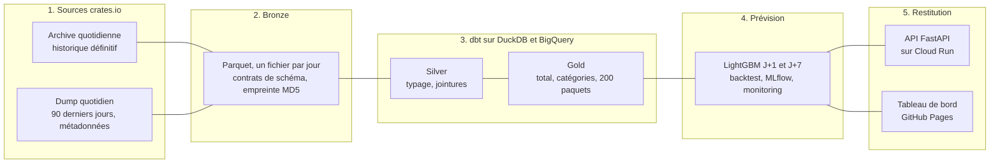

# PkgPulse

[](../../actions/workflows/ci.yml)
[](../../actions/workflows/daily.yml)


**En ligne, mis à jour chaque jour : le [tableau de bord](https://mohamedradhi52.github.io/pkgpulse/)
et l'[API de prévision](https://pkgpulse-api-bnhde7a6fa-uc.a.run.app/docs).**

Plateforme data construite sur les téléchargements réels de crates.io, le registre de paquets
Rust. Un pipeline quotidien idempotent alimente un entrepôt en architecture médaillon (DuckDB et
BigQuery), prévoit la demande à J+1 et J+7 pour 260 séries, mesure ses intervalles de prédiction,
surveille sa propre erreur et détecte les anomalies. Le problème est celui de la prévision de la
demande dans le retail : saisonnalité hebdomadaire, zéros, effets de nouvelles versions, pics
exogènes.

**Stack** : Python 3.14, DuckDB, dbt, BigQuery, LightGBM, statsforecast, MLflow, FastAPI, Docker,
Cloud Run, Terraform, Airflow, GitHub Actions.


## Résultats

MASE moyenne par série sur 20 origines de validation, du 18 avril au 17 septembre 2026, jamais
utilisées pour concevoir le modèle. Sous 1, on bat le naïf saisonnier. Chiffres du 30 septembre
2026 ; le pipeline les recalcule chaque jour dans la [release gold](../../releases/tag/gold).

| Série | Horizon | Naïf saisonnier | ETS | LightGBM | Gain sur la meilleure référence |
|---|---|---|---|---|---|
| Total | J+1 | 0,902 | 0,567 | 0,549 | +3 % |
| Total | J+7 | 0,747 | 0,707 | 0,689 | +3 % |
| Catégories (58 séries) | J+1 | 1,165 | 0,987 | 0,899 | +9 % |
| Catégories | J+7 | 1,113 | 1,160 | 1,066 | +4 % |
| Paquets suivis (200 séries) | J+1 | 0,971 | 0,717 | 0,630 | +12 % |
| Paquets suivis | J+7 | 0,966 | 1,026 | 0,929 | +4 % |

- **Intervalles conformels à 90 %** : couverture mesurée sans fuite de 94 % à J+1 et 97 % à J+7
  sur les paquets, 92 % sur les catégories. Sur les paquets à J+1, la demi-largeur vaut 12 % du
  niveau récent.
- **Total direct ou ascendant** (somme des 200 paquets et de la série autres) : pour LightGBM, la
  prévision directe gagne à J+1 (0,549 contre 0,579), l'agrégation à J+7 (0,642 contre 0,689).
- **Étude de cas** : le [pic du 21 juin 2026](docs/etude-de-cas-21-juin-2026.md) est un parcours
  de presque tout le registre, six fois plus de versions téléchargées mais invisible sur le total.

## Points clés

- **Ingestion idempotente et données tardives** : un jour correspond à un fichier Parquet remplacé
  de façon atomique ; l'archive définitive et le dump des 90 derniers jours sont joints par une
  règle testée. Une relance ne crée jamais de doublon, ce qui a servi pour de vrai après une
  erreur HTTP 500 de crates.io.
- **Qualité des données** : contrats de schéma à l'ingestion, dbt en architecture médaillon sur
  DuckDB et BigQuery (10 modèles, 33 tests dont fraîcheur, jours manquants et chute de volume) et
  snapshot de l'historique des paquets.
- **Prévision** : un LightGBM global par horizon pour 260 séries, comparé au naïf saisonnier et à
  ETS en backtest glissant ; conception et validation sur des origines séparées, tests anti-fuite,
  intervalles conformels et suivi MLflow.
- **MLOps** : erreur réalisée et MASE glissante chaque jour, seuil de dérive tiré du backtest, et
  challenger en mode fantôme, promu seulement s'il fait mieux que le champion.
- **Cloud et CI/CD** : infrastructure GCP en Terraform, API FastAPI sur Cloud Run redéployée à
  chaque push, pipeline quotidien dans GitHub Actions et DAG Airflow équivalent, surveillés.
- **Données ouvertes** : agrégats, prévisions et résultats du backtest publiés chaque jour dans la
  [release gold](../../releases/tag/gold).
- **Code testé** : 48 tests pytest, dont un faux serveur crates.io et une dérive simulée, CI et
  pre-commit.

## Architecture



Chaque jour à 5 h 17 UTC, après le dump de crates.io, GitHub Actions enchaîne ingestion, dbt,
backtest, prévision, monitoring et anomalies, publie les fichiers, le tableau de bord et les
données de BigQuery. Le même enchaînement est décrit par un DAG Airflow, testé en rejouant une
semaine.

## API

- `GET /forecast?series=paquet:serde` : prévisions J+1 et J+7 d'une série, avec leur intervalle à
  90 % ;
- `GET /series?level=categorie` : séries disponibles (total, catégories, paquets) ;
- `GET /anomalies?days=30` : anomalies récentes ;
- `GET /docs` : documentation interactive.

```bash
curl "https://pkgpulse-api-bnhde7a6fa-uc.a.run.app/forecast?series=paquet:serde"
```

## Ce que disent les données

- **La demande a été multipliée par 3,8** entre novembre 2025 et septembre 2026 : de 382 à 1 464
  millions de téléchargements par jour, en moyenne mensuelle.
- **La saisonnalité hebdomadaire est forte** : un dimanche pèse environ la moitié d'un mardi.
- **Le calendrier américain pèse** : les plus fortes anomalies tombent le 25 mai (Memorial Day)
  et le 7 septembre (Labor Day). La demande suit l'intégration continue des entreprises.
- **Une rupture de comptage** : fin octobre 2025, crates.io n'a plus compté que les
  téléchargements faits par cargo ; l'historique commence donc au 1er novembre 2025.

## Limites

- La validation couvre cinq mois, d'avril à septembre 2026, dans un seul régime de comptage.
- Les jours fériés ne sont pas encore des variables du modèle, alors qu'ils causent les plus
  fortes anomalies : c'est la prochaine amélioration.
- Le backtest utilise les valeurs définitives ; en production, le dernier jour peut être corrigé
  le lendemain. L'ingestion journalise chaque correction.
- Les catégories actuelles des paquets sont appliquées à tout l'historique.
- La comparaison directe contre ascendante ne porte que sur le total : les catégories ne sont pas
  additives.
- Le monitoring a démarré fin septembre 2026 : il lui faut 7 jours d'erreurs réalisées avant de
  pouvoir déclencher un ré-entraînement.
- GitHub Actions s'authentifie auprès de GCP par une clé de compte de service ; Workload Identity
  Federation éviterait une clé de longue durée.

## Démarrage

Prérequis : Python 3.14 et make.

```bash
make install   # environnement virtuel, dépendances et hooks pre-commit
make check     # lint, tests et dbt sur un échantillon synthétique, comme la CI
make ingest    # données réelles : archive depuis le 2025-11-01, puis dump du jour
make dbt       # fraîcheur des sources, modèles silver et gold, tests et snapshot
make publish backtest forecast monitor anomalies  # exports, prévision et suivi
make api       # API en local, documentation sur http://127.0.0.1:8000/docs
make dashboard # données du tableau de bord, aperçu : python -m http.server -d site
```

## Organisation du dépôt

```text
src/pkgpulse/ingest/    ingestion : archive, dump, jonction, contrats de schéma
dbt/                    modèles silver et gold, tests, snapshot, profils DuckDB et BigQuery
src/pkgpulse/forecast/  prévision : séries, références, LightGBM, backtest, MLflow
src/pkgpulse/monitor/   monitoring : erreurs réalisées, dérive, champion contre challenger
src/pkgpulse/anomalies/ détection d'anomalies sur les résidus de prévision
src/pkgpulse/api/       API FastAPI : /forecast, /series, /anomalies
site/                   tableau de bord statique
infra/                  Terraform : bucket, datasets BigQuery, Artifact Registry
airflow/dags/           DAG quotidien (dépendances, relances, backfill)
tests/                  tests pytest
docs/                   cadrage, journal des décisions, étude de cas
.github/workflows/      CI, pipeline quotidien, Terraform, déploiement, keepalive et surveillance
```

## Documentation

- [Cadrage](docs/cadrage.md) : séries prévues, horizons, ce que le modèle a le droit de savoir,
  métriques.
- [Journal des décisions](docs/DECISIONS.md) : les 18 choix techniques et leurs raisons.
- [Étude de cas du 21 juin 2026](docs/etude-de-cas-21-juin-2026.md).

Données : dumps publics de crates.io, utilisés dans le respect de leur politique d'accès. Seuls des
agrégats sont publiés. Code sous licence MIT.
